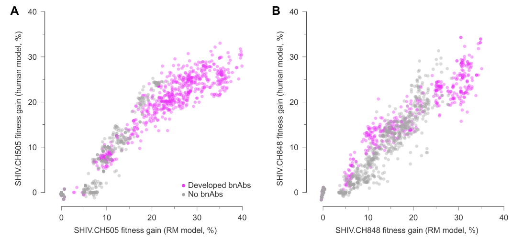
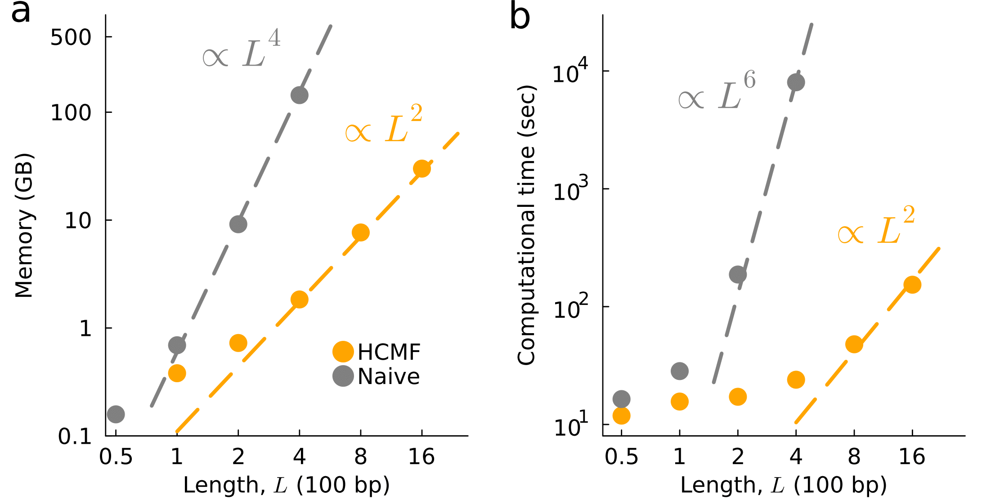
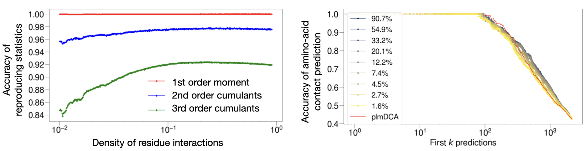

---
hide:
  - navigation
  #- toc
---

## [Quantitatively comapre selection pressure in HIV and SHIV (temp) :fontawesome-solid-paperclip:{ .small-icon }](https://doi.org/10.1101/2024.07.12.603090) 
<!--

  { width=350px }
  

Lorem ipsum dolor sit amet, consectetur adipiscing elit. Sed do eiusmod tempor incididunt ut labore et dolore magna aliqua. Ut enim ad minim veniam, quis nostrud exercitation ullamco laboris nisi ut aliquip ex ea commodo consequat.

-->

</small >
	{width=350px}
<small> 

**Title:** Parallel HIV-1 evolutionary dynamics in humans and rhesus macaques who develop broadly neutralizing antibodies  
**Authors:** <u>Kai S. Shimagaki</u>, Rebecca M Lynch, John P Barton  
**Status:**  *Preprint*, submitted in 2024 
**Summary:**
 Human Immunodeficiency Virus (HIV)-1 mutates rapidly within and between hosts, resulting in high genetic diversity. This diversity poses significant challenges for vaccine development, as effective vaccines must elicit antibodies capable of neutralizing a wide range of viral strains. Broadly neutralizing antibodies (bnAbs) against HIV exist, and inducing bnAbs through vaccination is considered the holy grail of HIV research. However, the development of bnAbs often takes several years of infection, and only 10-30% of HIV-positive individuals naturally develop them.
Multiple studies have highlighted the critical importance of the co-evolutionary process between the virus and the immune system. Investigations into this co-evolution have provided valuable insights for bnAb-based vaccine design. Despite these advances, the mechanisms underlying the bnAb development process remain incompletely understood.
In this study, we investigated two HIV subjects who developed bnAbs over more than five years of infection. We inferred viral selective pressures while fully considering genetic linkage effects. The strongly selected mutations identified were often reversion mutations or mutations affecting glycosylation on viral surface proteins, and these mutations appeared early in the infection. In contrast, mutations that emerged later were only moderately selected, and those escaping bnAbs were either moderately selected or nearly neutral.
Additionally, we examined a recent study involving Simian-HIV (SHIV)-positive macaques initially infected with SHIV containing the HIV Env genes transmitted from the two HIV patients who developed bnAbs, conducted by Roark and his colleagues. We quantitatively compared the fitness landscapes of HIV and SHIV and found striking similarities in both fitness and evolutionary patterns. For more details, please take a look at [our preprint](https://doi.org/10.1101/2024.07.12.603090). 

## [Efficient epistasis inference reveals evolutionary constraints :fontawesome-solid-paperclip:{ .small-icon }](https://doi.org/10.1101/2024.10.14.618287) 
</small >
	{width=350px}
<small> 

**Title:** Efficient epistasis inference via higher-order covariance matrix factorization  
**Authors:** <u>Kai S. Shimagaki</u> and John P Barton  
**Status:**  *Preprint*, submitted in 2024 
**Summary:**  
 Epistasis—the non-additive effects of mutations on phenotypic traits—is prevalent in evolutionary biology. The underlying fitness landscape, which shapes evolutionary trajectories, can be significantly influenced by these epistatic interactions. Recent experimental studies have revealed that viral surface proteins are involved in epistatic effects, playing a crucial role in evading the immune response. However, accurately inferring epistasis is challenging because the collective evolution of mutations—the primary signal for detecting epistasis—can result from evolutionary factors such as genetic linkage that do not directly alter fitness. To accurately infer epistatic interactions while accounting for genetic linkage, it is necessary to consider higher-order statistics, which poses a major bottleneck in analyzing real genetic sequences.
In this study, we developed efficient methods for epistasis inference that substantially reduce computational complexity from $\mathcal{O}(L^6)$ to $\mathcal{O}(L^2)$, where $L$ is the length of the genetic sequences. By leveraging this computational advantage, we inferred epistasis from longitudinal HIV evolution data collected from 16 subjects not undergoing anti-HIV drug treatment. For more detailed findings, please refer to [the preprint](https://doi.org/10.1101/2024.10.14.618287).

## [Enhancing consistency in mutation effect inference for deep mutational scanning data :fontawesome-solid-paperclip:{ .small-icon }](https://doi.org/10.1103/PhysRevE.107.024116) 
</small >
	{width=350px}
<small> 

**Title:** popDMS infers mutation effects from deep mutational scanning data  
**Authors:** Zhenchen Hong\*, <u>Kai S. Shimagaki\*</u>, and John P. Barton. (\*:equal contribution)  
**Status:**  Published from *Bioinformatics* in 2024 
**Summary:**  
Deep mutational scanning (DMS) is a powerful experimental method for measuring the impacts of genetic mutations on phenotypic traits. However, data generated from mutagenesis experiments can involve substantial noise, and estimating mutation effects based on mutation frequency measurements—the most commonly used approach—can lead to higher variation between experimental replicates under the same conditions. To overcome this challenge, we developed popDMS, a computational method for estimating mutation effects based on a population genomics model. Through the past twenty-eight DMS experiments, we found that popDMS infers fitness effects with significantly higher consistency between replicates.
  
## [Non-linear interpolation of temporal covariance enhances inference from evolutionary data :fontawesome-solid-paperclip:{ .small-icon }](https://doi.org/10.1103/PhysRevE.107.024116)
</small >
	{width=350px}
<small> 

**Title:** Bézier interpolation improves the inference of dynamical models from data  
**Authors:** <u>Kai Shimagaki</u>, and John P. Barton.  
**Status:**  Published from *Physical Review E* in 2024 
**Summary:**  
Temporal genetic sequence data provide valuable insights into evolutionary processes in biology. However, when time points are too distant—often due to limited sequencing efforts—investigating the evolution of genetic sequences becomes challenging. For example, the rate at which mutant frequencies increase can indicate the strength of selection pressure. Yet, with distant and sparse time points, information about the rapidity of frequency changes is lost.
To overcome this challenge, we developed a generic method to interpolate evolutionary data for individual mutations, taking into account that the true mutation frequency dynamics are non-linear and smooth. This method simultaneously interpolates both the covariance of mutations and their frequencies, allowing for straightforward integration over the course of evolution.
We applied this interpolation framework to two types of statistical inference problems: inferring fitness effects based on population genomics models and inferring the forces driving an Ornstein-Uhlenbeck process. Our findings demonstrate that the non-linear interpolation method improves inference accuracy for both problems, with the improvement being more pronounced when the observed time points are sparse and poorly sampled.

## [Improving generative model interpretability and robustness via sparsity :fontawesome-solid-paperclip:{ .small-icon }](https://doi.org/10.1103/PhysRevE.104.024407)
</small >
	{width=450px}
<small> 
**Title:** Sparse generative modeling via parameter reduction of Boltzmann machines: application to protein-sequence families  
**Authors:** Pierre Barrat-Charlaix\*, Anna Paola Muntoni\*, <u>Kai Shimagaki\*</u>, Martin Weigt, and Francesco Zamponi. (\*:equal contribution)  
**Status:**  Published from *Physical Review E* in 2021 
**Summary:**  
Boltzmann machines (BMs) are widely used as generative models in various fields. For example, pairwise Potts models (PMs), which are instances of the BM class, provide accurate statistical models of families of evolutionarily related protein sequences. This approach, known as Direct Coupling Analysis, has been successful in predicting residue contacts in three-dimensional structures, assessing mutational effects, and generating new functional sequences. However, these models require optimizing between $10^6$ and $10^7$ parameters, while the available statistics are one to three orders of magnitude smaller. This discrepancy can lead to overfitting issues, and most of the parameters are difficult to interpret.
In this work, we developed a generic parameter-reduction framework by progressively decimating the statistically less significant parameters in a computationally efficient manner. For several protein families, their approach successfully reduced the number of model parameters by more than 90%. Additionally, we found that the sparser generative models are more robust against parameter perturbations compared to conventional dense models.

## [Interpretable generative model for protein sequences and sequence motif selection :fontawesome-solid-paperclip:{ .small-icon }](https://doi.org/10.1103/PhysRevE.100.032128)
</small >
	{width=350px}
<small> 
**Title:** Selection of sequence motifs and generative Hopfield-Potts models for protein families  
**Status:**  Published from *Physical Review E* in 2019 
**Authors:** <u>Kai Shimagaki</u>, and Martin Weigt. 
**Summary:**   
Statistical models for families of evolutionarily related proteins can provide valuable biological insights, such as the three-dimensional structures of folded proteins and the effects of amino acid substitutions. Although these approaches have been successful, they rely on ad hoc parameters that must be estimated from limited datasets, and their biological interpretations remain unclear. In this study, we developed a method to reduce the number of parameters by selecting collective sequence motifs. We found that when applied to protein data, this approach can successfully generate protein sequences while reproducing the statistical qualities observed in natural protein sequences using only 20-40 patterns, achieving up to a 95% reduction in model parameters. The identified patterns effectively classify functionally different protein subfamilies and provide biological interpretations, as well as residue contact maps used for three-dimensional structure prediction.

<!-- 

  { width=350px }
 
    __Kai Shimagaki__&nbsp;&nbsp;
    <small>
    [:fontawesome-brands-google-scholar:{ .middle }](https://scholar.google.com/citations?user=BJF41UIAAAAJ&hl=en) 
    [:fontawesome-brands-github:{ .middle }](https://github.com/shimagaki) 
    </small>
      Some description about Kai Shimagaki goes here. This text will appear to the right of the image and will adjust based on screen size.
**Status:**  Published from *Physical Review E* in 2019 
**Authors:** Kai Shimagaki, and Martin Weigt. 
**Summary:**   
Lorem ipsum dolor sit amet, consectetur adipiscing elit. Sed do eiusmod tempor incididunt ut labore et dolore magna aliqua. Ut enim ad minim veniam, quis nostrud exercitation ullamco laboris nisi ut aliquip ex ea commodo consequat.

--->
